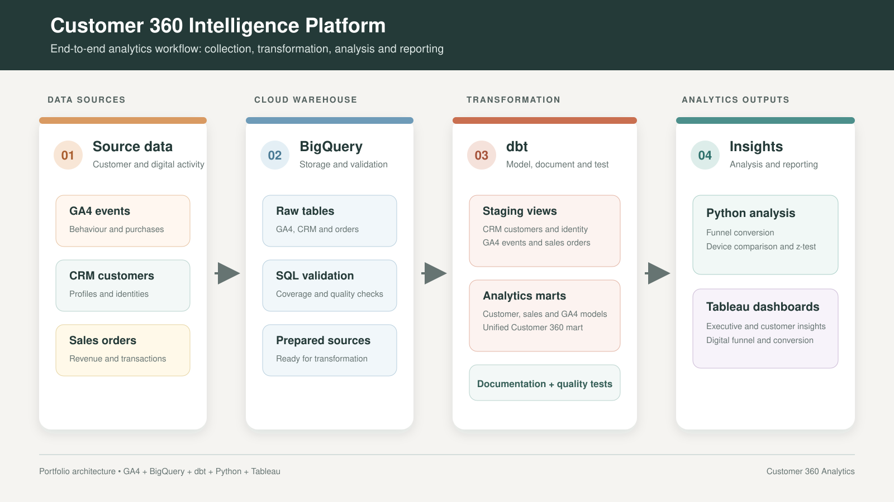
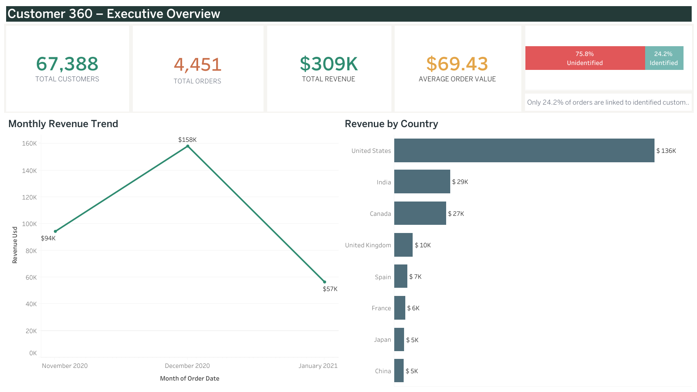
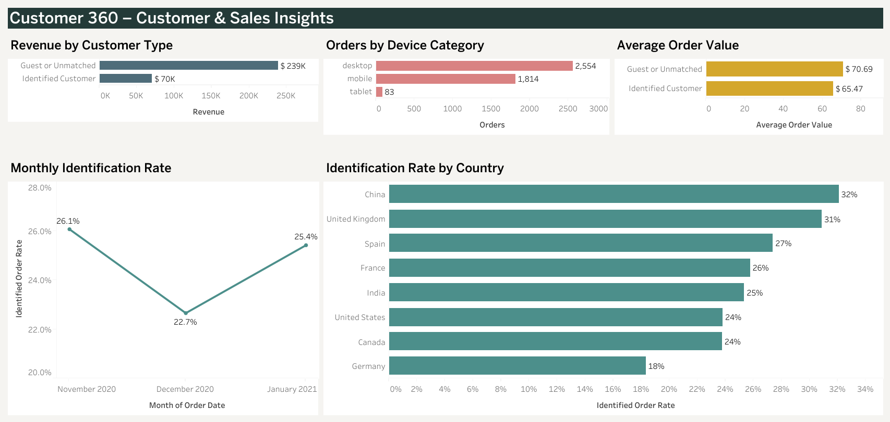
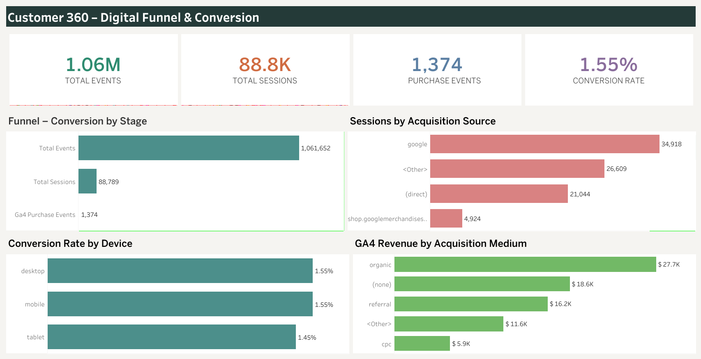

# Customer 360 Intelligence Platform

An end-to-end analytics portfolio project combining **GA4 behavioural data, CRM customer records and sales orders** to build a unified Customer 360 view.

The project demonstrates data validation in BigQuery, transformation and testing with dbt, statistical analysis in Python and business reporting in Tableau.



## Live Tableau Dashboard

[View the published Customer 360 Analytics Dashboard](https://public.tableau.com/app/profile/rahul.chhabra2325/viz/Customer360AnalyticsDashboard_17890289216270/ExecutiveOverview?publish=yes)

The workbook contains three dashboard pages:

1. Executive Overview
2. Customer & Sales Insights
3. Digital Funnel & Conversion

### Executive Overview



### Customer & Sales Insights



### Digital Funnel & Conversion



## Business Questions

- How are users acquired and how well do acquisition sources perform?
- Where do customers leave the e-commerce funnel?
- How do customer behaviour and sales activity connect?
- Does checkout conversion differ meaningfully between mobile and desktop users?
- Which metrics should business teams monitor through an executive dashboard?

## Solution Architecture

1. **GA4, CRM and sales sources** provide behavioural, customer and transaction data.
2. **BigQuery** stores the source tables and supports SQL validation.
3. **dbt** creates documented staging views and analytics marts with data-quality tests.
4. **Python** calculates funnel conversion, drop-off rates and device-level statistical comparisons.
5. **Tableau** presents executive, customer, sales and digital funnel insights.

## Key Findings

### Tableau overview metrics

- 1.06 million GA4 events
- 88.8 thousand sessions
- 1,374 purchase events
- 1.55% reported conversion rate

### Python funnel analysis

- 61,252 users viewed an item.
- 12,545 added an item to the cart.
- 9,715 began checkout.
- 4,419 completed a purchase.
- The largest loss occurred between product view and add to cart: **79.52% drop-off**.
- The overall purchase rate from product viewers was **7.21%**.

### Device comparison

- Desktop checkout conversion: **44.95%**
- Mobile checkout conversion: **46.17%**
- Difference: **1.22 percentage points**
- Two-proportion z-test p-value: **0.2403**
- 95% confidence interval: **-0.82% to 3.26%**

The mobile result was slightly higher, but the difference was not statistically significant. This does not provide strong evidence for a device-specific checkout change.

> The Tableau overview uses dashboard-level event and session metrics, while the Python funnel uses unique users at defined funnel stages. The figures therefore answer different analytical questions.

## dbt Models

### Staging

- `stg_crm_customers`
- `stg_crm_identity_map`
- `stg_ga4_events`
- `stg_sales_orders`

### Analytics marts

- `dim_customers`
- `fct_ga4_events`
- `fct_sales_orders`
- `mart_customer_360`

Not-null and uniqueness tests are defined in the dbt YAML files. Evidence of the completed and merged dbt pipeline is available in `dbt_customer360/screenshots`.

## Repository Structure

```text
customer360-intelligence-platform/
├── assets/              # Architecture diagram
├── bigquery/            # SQL scripts, query results and evidence
├── data/sample/         # Sample inputs used by the Python notebook
├── dbt_customer360/     # dbt project, models, tests and documentation
├── docs/                # Data dictionary and project methodology
├── final-outputs/       # Selected publishing assets
├── ga4/                 # GA4 exploration screenshots and reports
├── python/              # Notebook, charts and statistical outputs
└── tableau/             # Tableau workbook, screenshots and PDF export
```

## Main Technologies

- Google Analytics 4
- Google BigQuery and SQL
- dbt
- Python: pandas, NumPy, Matplotlib, Seaborn, SciPy and statsmodels
- Tableau
- GitHub

## Reproducing the Python Analysis

1. Open `python/notebooks/ga4_funnel_conversion_analysis.ipynb`.
2. Confirm that the two CSV files are available in `data/sample`.
3. Run the notebook cells in order.
4. Review generated CSV files in `python/outputs` and charts in `python/screenshots`.

To run the dbt project, configure a compatible BigQuery connection and execute `dbt build` from the `dbt_customer360` directory.

## Documentation

- `docs/data-dictionary/DATA_DICTIONARY.md`
- `docs/methodology/METHODOLOGY.md`
- `dbt_customer360/README.md`
- `python/README.md`
- `tableau/README.md`

## Limitations

- The analysis uses anonymised public GA4 sample data rather than live production data.
- Device results are observational and do not establish causation.
- Guest and unmatched orders may have a null customer identifier.
- Recommendations should be validated with current business data and controlled experiments.
